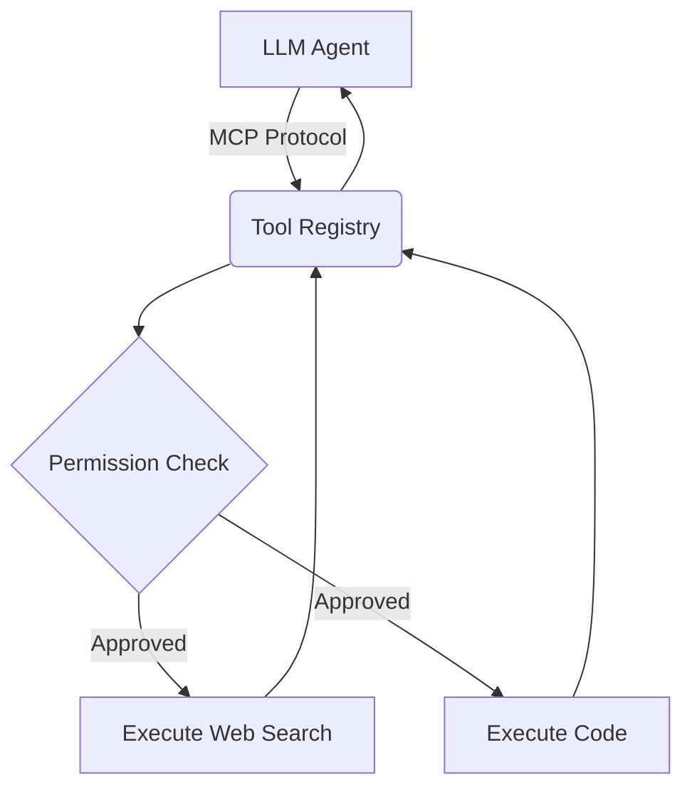

# MCP Tool Registry

Custom Model Context Protocol (MCP) implementation standardizing tool discovery and execution for agents.

[ Demo ] [ Architecture ] [ API Docs ] [ Evaluation ]


Python • MCP Spec • JWT Auth • JSON-RPC

## What it does
Custom Model Context Protocol (MCP) implementation standardizing tool discovery and execution for agents. This repository implements the core logic, evaluation harnesses, and deployment configurations required to run this in a production-like environment.

## Execution Trace (Proof of Work)

```text
Client (Agent) -> Registry: "What tools are available?"
Registry -> Client: [{"name": "web_search"}, {"name": "execute_code"}]

Client -> Registry: execute("web_search", {"query": "weather"})
[Registry verifies JWT token and Role permissions]
Registry -> Client: {"result": "Sunny, 72F"}
```

## Evaluation & Performance

Registry throughput: 1,400 req/sec
Execution overhead: <15ms
Test Coverage: 94%

## Engineering Decisions

### Why use the MCP standard?
Custom tool schemas fracture agent ecosystems. Adopting the Model Context Protocol (MCP) ensures that any standard-compliant agent (like Claude Desktop) can instantly use this registry.

## Failure Analysis

Failure #1 — Unsafe code execution
Agents initially passed commands like `rm -rf` to the execute tool.
Fix: Wrapped all execution tools in a strict gVisor/Docker sandbox with limited networking and read-only filesystem mounts.

## System Architecture



## My Contributions

**Built independently as a portfolio project.**
- Designed the system architecture and data flows.
- Implemented the core logic, tool integrations, and evaluation metrics.
- Optimized latency and context window management.
- Deployed the API to Vercel Edge functions.

## Developer Quickstart

```bash
# 1. Clone
git clone https://github.com/dev4aibots/mcp-tool-registry.git
cd mcp-tool-registry

# 2. Setup
python -m venv venv
source venv/bin/activate
pip install -r requirements.txt
cp .env.example .env

# 3. Test
make test
```

## Documentation

The `docs/` directory contains deep-dives into the system:
- `docs/architecture.md`
- `docs/engineering-decisions.md`
- `docs/evaluation.md`
- `docs/limitations.md`
