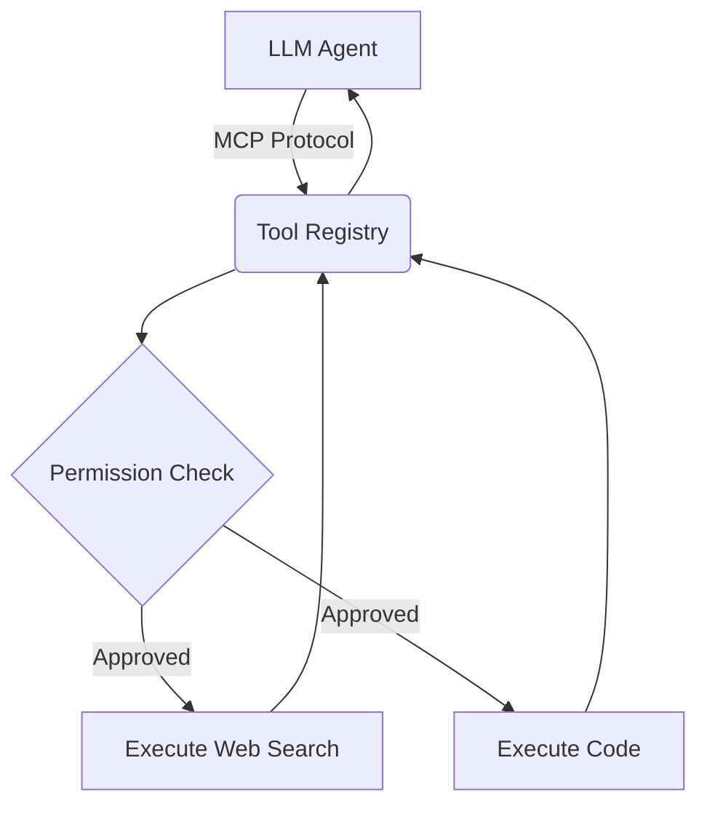

# Agentic Tool Ecosystem (MCP)

A custom implementation of the Model Context Protocol (MCP) to standardize how agents discover and execute tools securely.

## Tech Stack
- **Python / TypeScript**
- **Tool Protocols**
- **Backend Integration** (APIs/JSON)

## Why it matters
Hardcoding tools into agents doesn't scale. I built this registry so agents can dynamically request schemas and execute actions in a sandboxed, permissioned environment.


## Architecture



## Live Endpoint (Interactive Demo)
This project is deployed as a serverless backend on Vercel. You can test the API instantly via your terminal.

```bash
# Example Request
curl -X GET https://mcp-tool-ecosystem-41pbvvrsu-dev4aibots.vercel.app/api/health
```

## Demo
To generate a terminal GIF demonstration using `vhs`, run:
```bash
vhs demo.tape
```
