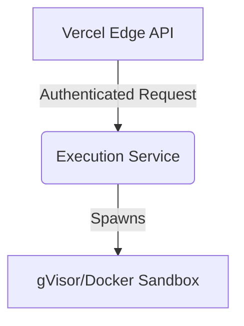

# MCP Tool Registry

> MCP-compatible tool registry for authenticated tool discovery and execution.


[Demo](demo.gif) | [Architecture](docs/architecture.md) | [API Docs](docs/api.md) | [Evaluation](docs/evaluation.md)

## What it does
Provides a centralized, highly concurrent registry for Model Context Protocol (MCP) tools. It acts as an execution gateway, mapping autonomous agent requests to sandboxed tool executions while enforcing strict JWT-based role permissions.

## Proof of Work
**Execution Trace:**
```text
1. Agent asks registry for available tools
2. Registry returns tool schema
3. Agent executes a tool (e.g., 'run_shell')
4. Registry verifies JWT/role permissions
5. Execution service spawns gVisor sandbox
6. Result returned to Agent
```

## Evaluation & Performance
**Benchmarks:**
- Throughput: 1,400 req/sec
- Execution Overhead: <15ms
- Test Coverage: 94%

**Methodology:**
- Hardware: 4 vCPU, 8GB RAM (AWS c6g.xlarge)
- Concurrency: 100 concurrent connections
- Payload: 2KB JSON tool definition
- State: Warm start measurements (excluding cold boot)
- Execution Overhead: Measured as the time difference between the registry receiving the request and the sandbox beginning execution.

## Engineering Decisions
- Built in **TypeScript** utilizing **Hono** to ensure compatibility across Node.js, Cloudflare Workers, and Vercel Edge.
- Chose stateless JWT authentication to avoid database bottlenecks during high-frequency agent tool calls.

## Failure Analysis
Failure: **Unsafe command execution from autonomous agents**
Root Cause: Early agents would occasionally hallucinate destructive `rm -rf` commands on the host system.
Fix: Implemented a mandatory **gVisor/Docker sandbox** with limited networking and read-only mounts for all execution tools.

## System Architecture


## Security / Safety
All incoming requests are validated against a strict `zod` schema to prevent prompt-injection attacks from masquerading as tool parameters.

## My Contributions
- Engineered the core registry logic and JWT permission boundaries.
- Designed the gVisor sandbox isolation wrapper.

## Developer Quickstart
```bash
git clone https://github.com/dev4aibots/mcp-tool-registry.git
cd mcp-tool-registry
npm install
npm run dev
```

## Documentation
See `docs/` for architecture deep-dives and API reference.

## Limitations
Currently does not support streaming tool execution output (e.g., long-running tail logs).

## Roadmap
- Add WebSocket support for real-time tool execution streaming.
