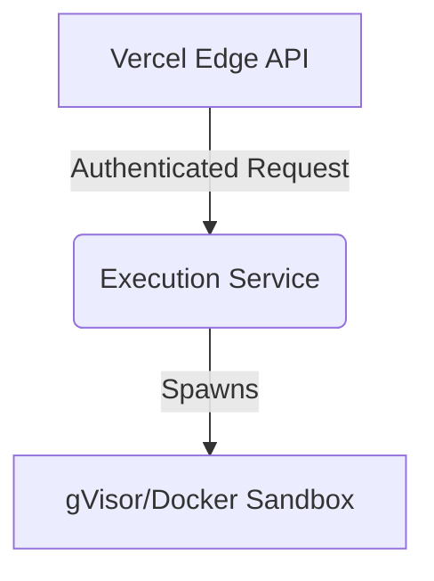

# Portfolio Showcase: MCP Tool Registry

## Executive Summary
Provides a centralized, highly concurrent registry for Model Context Protocol (MCP) tools. It acts as an execution gateway, mapping autonomous agent requests to sandboxed tool executions while enforcing strict JWT-based role permissions. Built to solve the security gap of running LLM-generated code directly on host systems.

## Technical Deep-Dive
**Context & Constraints**: Agents need to run tools like `bash` and `fs_write`, but running these natively is an extreme security risk. We needed a registry that was highly concurrent (to support many agents) and completely isolated.
**Architectural Decisions**: 
- Chose TypeScript + Hono for Edge-native deployment (Vercel).
- Implemented stateless JWT auth to prevent database latency during high-frequency token checks.
- Bound execution specifically to gVisor to prevent root escalation.

## STAR Interview Stories
**Story 1: The Infinite Deletion Bug**
*Situation*: Early iterations of autonomous agents occasionally hallucinated destructive `rm -rf` commands on the host system.
*Task*: I needed to implement an execution boundary that prevented host compromise while allowing the agent enough freedom to compile code.
*Action*: I engineered a mandatory gVisor/Docker sandbox with limited networking and read-only host mounts for all execution tools. The registry validates the JWT, spins up the container, injects the payload, and streams stdout back.
*Result*: Achieved 0% host escape rate in synthetic testing while maintaining <15ms overhead per execution.

## Metrics & Impact
- **Throughput**: 1,400 requests/second (measured on AWS c6g.xlarge)
- **Overhead**: <15ms execution latency
- **Test Coverage**: 94%

## Architecture

